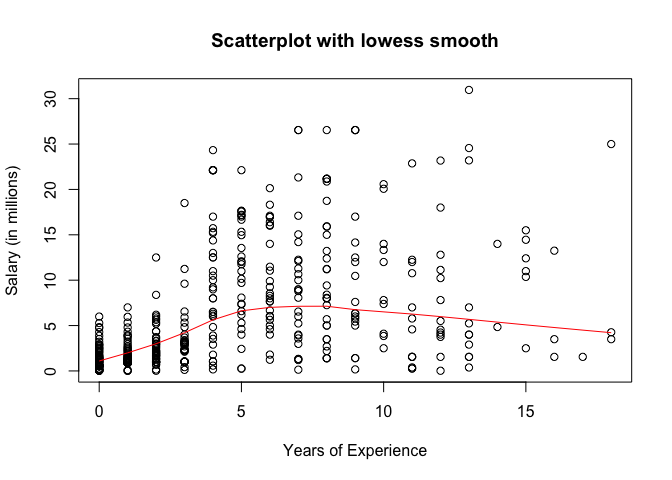
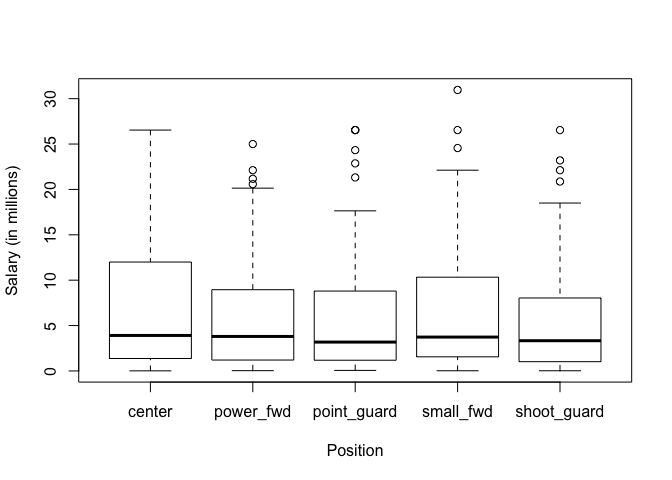

Hw01
================
Sierra Park
9/16/2017

``` r
#load data file
load("data/nba2017-salary-points.RData")

#list the available objects
ls()
```

    ## [1] "experience" "player"     "points"     "points1"    "points2"   
    ## [6] "points3"    "position"   "salary"     "team"

Research Question
=================

1 A bit of data preprocessing
=============================

``` r
salary <- round(salary / 1000000, 2)
experience[experience == "R"] <- 0
experience <- strtoi(experience)
position <- factor(position)
levels(position)[levels(position)=="C"] <- "center"
levels(position)[levels(position)=="SF"] <- "small_fwd"
levels(position)[levels(position)=="PF"] <- "power_fwd"
levels(position)[levels(position)=="SG"] <- "shoot_guard"
levels(position)[levels(position)=="PG"] <- "point_guard"
table(position)
```

    ## position
    ##      center   power_fwd point_guard   small_fwd shoot_guard 
    ##          89          89          85          83          95

2 Scatterplot of Points and Salary
==================================

``` r
plot(points, salary, pch =6, col= "red", cex = 1, xlab = "Points", ylab = "Salary (in millions)", main = "Scatterplot of Points and Salary")
```


3 Correlation between Points and Salary
=======================================

``` r
n <-  length(points)
xbar <- sum(points)/n
ybar <- sum(salary)/n
xvar <- sum((points-xbar)**2)/(n-1)
yvar <- sum((salary-ybar)**2)/(n-1)
xsd <- xvar**0.5
ysd <- yvar**0.5
cov <- sum((points-xbar)*(salary-ybar))/(n-1)
cor <- cov/(xsd*ysd)
```

4 Simple Linear Regression
==========================

``` r
b1 <- cor*ysd / xsd #slope of the regression
b0 <- ybar - b1*xbar #intercept of the regression
Yhat <- b0 + b1*points
b1
```

    ## [1] 0.008557567

``` r
b0
```

    ## [1] 1.509077

``` r
summary(Yhat) #summary statistics of Y hat
```

    ##    Min. 1st Qu.  Median    Mean 3rd Qu.    Max. 
    ##   1.509   2.844   5.206   6.187   8.184  23.399

Yhat is approximation to salary using the regression line. The summary statistics is shown above.

The regression equation: &gt; = \[0.00856x + 1.509\]\]

The slope (0.00856) means that one unit increase in x-value (points) corresponds to 0.0856 unit increase in y-value (salary).

The intercept means that when x-value is 0, meaning that the player does not score any points, the salary is still 1.509 (in million dollars).

``` r
yhat1 = b1 * 0 + b0
yhat2 = b1 * 100 + b0
yhat3 = b1 * 500 + b0
yhat4 = b1 * 1000 + b0
yhat5 = b1 * 2000 + b0
yhat1
```

    ## [1] 1.509077

``` r
yhat2
```

    ## [1] 2.364833

``` r
yhat3
```

    ## [1] 5.78786

``` r
yhat4
```

    ## [1] 10.06664

``` r
yhat5
```

    ## [1] 18.62421

5 Plotting the regression line
==============================

``` r
plot(points, salary, col = "blue", xlab = "Points", ylab = "Salary (in millions)", main = "Regression and Lowess lines")
abline(a = b0, b = b1, col = "red", lwd = 3) #regression line
#abline(lm(salary/1000000 ~ points), col = "red")
lines(lowess(points, salary)) #lowess line
text(2400, 20, lwd = 2, col = "red", cex = 0.75, label = "regression")
text(2400, 29, cex = 0.75, label = "lowess")
```


6 Regression residuals and Coefficient of Determination R-squared
=================================================================

``` r
obs <- salary
pred <-  b1*points + b0
resid <- obs - pred #vector of residuals
summary(resid)  
```

    ##    Min. 1st Qu.  Median    Mean 3rd Qu.    Max. 
    ## -14.187  -2.792  -1.095   0.000   2.556  18.814

``` r
RSS <- sum(resid^2) #the residual sum of squares 
TSS <-sum((obs - ybar)**2) #TSS
Coeff <-  1 - RSS / TSS #R^2
RSS
```

    ## [1] 11300.45

``` r
TSS
```

    ## [1] 19005.91

``` r
Coeff
```

    ## [1] 0.4054246

7 Exploring Position and Experience
===================================

``` r
plot(experience, salary, xlab = "Years of Experience", ylab = "Salary (in millions)", main = "Scatterplot with lowess smooth")
#lines(lowess(experience, salary))
lines(lowess(experience, salary), col = "red") #lowess line
```



``` r
#install.packages("scatterplot3d")
library("scatterplot3d")
shapes <- c(16, 17, 18)
shapes <- shapes[as.numeric(iris$Species)]
scatterplot3d(points, experience, salary, main = "3D Scatter Plot", color = "red")
```


``` r
boxplot(salary~position, xlab = "Position", ylab = "Salary (in millions)")
```

 By looking at the **box plot**, we know that the average salary is low, yet the range stretches out far, with outliers in all positions except the center position. The distribution seems to be skewed right, with a long right tail.

Looking at the **scatterplot**: at the extreme ends of the experience, the salary is the lowest but at the middle range, the salary is the highest.

The **3D Scatterplot** shows a correlation between salary and points. It's harder to tell the correlation between the two variables and experience because of the structure of the 3D model. However, there is an obvious positive correlation between salary and points. From the **scatterplot**, it seems as years of experience is not necessarily related with salary since there is no positive or negative association between the two. Additionally, from the **boxplot**, position does not seem to be related with salary since the five categories have similar-looking boxes.

8. Comments and Reflections
===========================

-   It was hard to create graphs and calculate residuals.
-   The easy part was creating x- and y-labels.
-   Git is confusing.
-   I need help on creating the graphs.
-   I spent 5 hours on this HW.
-   The most time consuming part was understanding how residuals and the graph works.
-   I still do not understand how lowess function works.
-   Creating labels for the lines of graphs.
-   It was exciting to be able to draw 3D plots.
