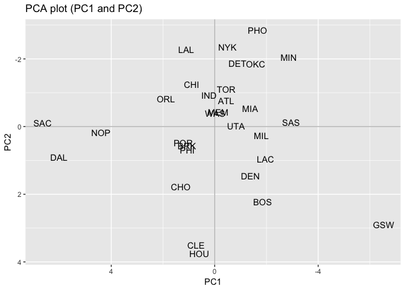

hw03
================
Sierra Park
10/5/2017

``` r
library(dplyr)
```

    ## Warning: package 'dplyr' was built under R version 3.4.2

    ## 
    ## Attaching package: 'dplyr'

    ## The following objects are masked from 'package:stats':
    ## 
    ##     filter, lag

    ## The following objects are masked from 'package:base':
    ## 
    ##     intersect, setdiff, setequal, union

``` r
library(ggplot2)
```

Ranking of Teams
================

``` r
getwd()
```

    ## [1] "/Users/spark/Documents/UCBERKELEY/2017Fall/stat133/stat133-hws-fall17/hw03/report"

``` r
teams <- read.csv("../data/nba2017-teams.csv", stringsAsFactors = FALSE)
teams
```

    ##    X.1  X team experience salary points3 points2 free_throws points
    ## 1    1  1  ATL         93  90.89     626    2254        1373   4253
    ## 2    2  2  BOS         63  91.92     985    2183        1536   4704
    ## 3    3  3  BRK         52  65.45     738    1950        1381   4069
    ## 4    4  4  CHI         58  92.08     565    2162        1330   4057
    ## 5    5  5  CHO         66 100.25     808    2102        1499   4409
    ## 6    6  6  CLE        128 125.79    1012    2107        1355   4474
    ## 7    7  7  DAL         62  92.10     754    1803        1042   3599
    ## 8    8  8  DEN         74  78.38     868    2347        1471   4686
    ## 9    9  9  DET         55 103.07     631    2638        1140   4409
    ## 10  10 10  GSW        101  98.69     982    2540        1447   4969
    ## 11  11 11  HOU         56  84.66    1141    1769        1508   4418
    ## 12  12 12  IND         84  84.57     641    2331        1333   4305
    ## 13  13 13  LAC        124 114.78     841    2401        1586   4828
    ## 14  14 14  LAL         66  86.27     592    2249        1080   3921
    ## 15  15 15  MEM         83 108.34     750    2140        1465   4355
    ## 16  16 16  MIA         63  72.78     799    2349        1217   4365
    ## 17  17 17  MIL         64  90.27     718    2424        1388   4530
    ## 18  18 18  MIN         48  59.38     601    2623        1585   4809
    ## 19  19 19  NOP         55  90.63     513    1952        1120   3585
    ## 20  20 20  NYK         59  97.01     636    2445        1262   4343
    ## 21  21 21  OKC         55  86.98     611    2380        1511   4502
    ## 22  22 22  ORL         57 102.41     614    2168        1230   4012
    ## 23  23 23  PHI         34  55.78     690    1917        1212   3819
    ## 24  24 24  PHO         68  72.53     564    2551        1605   4720
    ## 25  25 25  POR         43 103.03     852    2156        1386   4394
    ## 26  26 26  SAC         68  88.19     558    1838         998   3394
    ## 27  27 27  SAS         99 104.69     743    2459        1431   4633
    ## 28  28 28  TOR         57 108.46     626    2359        1570   4555
    ## 29  29 29  UTA         71  80.32     791    2242        1401   4434
    ## 30  30 30  WAS         56  98.78     671    2417        1316   4404
    ##    off_rebounds def_rebounds assists steals blocks turnovers fouls
    ## 1           807         2537    1784    601    354      1136  1329
    ## 2           744         2698    2069    617    341      1037  1686
    ## 3           608         2546    1593    547    372      1152  1522
    ## 4           865         2416    1746    605    339       952  1275
    ## 5           634         2636    1805    550    320       827  1198
    ## 6           727         2639    1760    475    299      1005  1318
    ## 7           534         2109    1291    538    266       703  1280
    ## 8           867         2646    2009    538    285      1097  1458
    ## 9           908         2838    1731    574    310       932  1467
    ## 10          759         2854    2475    779    551      1171  1565
    ## 11          766         2429    1906    564    292      1046  1314
    ## 12          679         2436    1713    612    391       996  1490
    ## 13          740         2790    1848    613    349      1024  1626
    ## 14          909         2462    1430    593    307      1028  1593
    ## 15          866         2534    1669    612    329       973  1748
    ## 16          857         2649    1728    577    464      1019  1647
    ## 17          700         2541    1953    651    422      1064  1601
    ## 18          938         2530    1934    652    370      1095  1644
    ## 19          580         2244    1523    497    380       823  1164
    ## 20          961         2591    1499    526    451       975  1584
    ## 21          936         2628    1610    595    394      1133  1561
    ## 22          699         2435    1744    544    302       978  1432
    ## 23          673         2282    1788    599    369      1184  1516
    ## 24          882         2456    1530    587    385      1171  1886
    ## 25          710         2437    1519    524    345       988  1587
    ## 26          524         1878    1394    503    234       847  1302
    ## 27          821         2768    1926    650    485      1038  1479
    ## 28          848         2533    1469    621    379       933  1609
    ## 29          771         2774    1651    550    410      1061  1545
    ## 30          748         2393    1861    605    314      1017  1465
    ##    efficiency        PC1        PC2   scaledPC
    ## 1    140.3269  0.2883171  0.1281265  55.471897
    ## 2    148.2525  1.6475677 -1.8678932  68.432930
    ## 3    147.7823 -0.6378694 -0.6410895  46.640314
    ## 4    139.1025 -0.7889514  0.5491124  45.199683
    ## 5    145.2994 -1.4213891 -1.7716179  39.169120
    ## 6    177.8585 -1.1429197 -1.9254795  41.824445
    ## 7    148.2243 -5.1770470 -0.3771922   3.357322
    ## 8    167.3595  0.8628216 -0.9755539  60.950042
    ## 9    136.3762  0.4228059  1.3520635  56.754305
    ## 10   172.3916  4.9580722 -2.2173199 100.000000
    ## 11   155.1031 -0.7434842 -3.2031420  45.633232
    ## 12   135.0697 -0.1393098  0.3561238  51.394292
    ## 13   147.1242  1.6926408 -0.7550453  68.862721
    ## 14   143.9768 -0.7449230  2.0200116  45.619512
    ## 15   140.9707  0.6071090  0.4667924  58.511713
    ## 16   151.9902  1.1154708  0.5570744  63.359160
    ## 17   153.2588  1.4939629 -0.1637954  66.968243
    ## 18   144.8383  2.5754284  1.1769429  77.280477
    ## 19   164.2521 -3.8867632  0.3023898  15.660728
    ## 20   143.9033  0.4804728  2.0259452  57.304183
    ## 21   146.8680  1.5554071  1.3170619  67.554140
    ## 22   125.1406 -1.4831168  0.2204544  38.580520
    ## 23   164.0916 -0.7149664 -0.3641317  45.905162
    ## 24   144.3065  2.0387934  2.2997473  72.163434
    ## 25   143.7321 -0.8965058 -0.2071566  44.174106
    ## 26   148.3954 -5.5291364  0.4742780   0.000000
    ## 27   146.6236  2.2990719 -0.1427248  74.645300
    ## 28   158.7658  0.6469827  1.3120040  58.891926
    ## 29   145.8193  0.7307586 -0.1550934  59.690765
    ## 30   143.0117 -0.1093009  0.2091070  51.680440

Basic Rankings
--------------

``` r
descsalary <-  teams %>% arrange(desc(salary))
descsalary
```

    ##    X.1  X team experience salary points3 points2 free_throws points
    ## 1    6  6  CLE        128 125.79    1012    2107        1355   4474
    ## 2   13 13  LAC        124 114.78     841    2401        1586   4828
    ## 3   28 28  TOR         57 108.46     626    2359        1570   4555
    ## 4   15 15  MEM         83 108.34     750    2140        1465   4355
    ## 5   27 27  SAS         99 104.69     743    2459        1431   4633
    ## 6    9  9  DET         55 103.07     631    2638        1140   4409
    ## 7   25 25  POR         43 103.03     852    2156        1386   4394
    ## 8   22 22  ORL         57 102.41     614    2168        1230   4012
    ## 9    5  5  CHO         66 100.25     808    2102        1499   4409
    ## 10  30 30  WAS         56  98.78     671    2417        1316   4404
    ## 11  10 10  GSW        101  98.69     982    2540        1447   4969
    ## 12  20 20  NYK         59  97.01     636    2445        1262   4343
    ## 13   7  7  DAL         62  92.10     754    1803        1042   3599
    ## 14   4  4  CHI         58  92.08     565    2162        1330   4057
    ## 15   2  2  BOS         63  91.92     985    2183        1536   4704
    ## 16   1  1  ATL         93  90.89     626    2254        1373   4253
    ## 17  19 19  NOP         55  90.63     513    1952        1120   3585
    ## 18  17 17  MIL         64  90.27     718    2424        1388   4530
    ## 19  26 26  SAC         68  88.19     558    1838         998   3394
    ## 20  21 21  OKC         55  86.98     611    2380        1511   4502
    ## 21  14 14  LAL         66  86.27     592    2249        1080   3921
    ## 22  11 11  HOU         56  84.66    1141    1769        1508   4418
    ## 23  12 12  IND         84  84.57     641    2331        1333   4305
    ## 24  29 29  UTA         71  80.32     791    2242        1401   4434
    ## 25   8  8  DEN         74  78.38     868    2347        1471   4686
    ## 26  16 16  MIA         63  72.78     799    2349        1217   4365
    ## 27  24 24  PHO         68  72.53     564    2551        1605   4720
    ## 28   3  3  BRK         52  65.45     738    1950        1381   4069
    ## 29  18 18  MIN         48  59.38     601    2623        1585   4809
    ## 30  23 23  PHI         34  55.78     690    1917        1212   3819
    ##    off_rebounds def_rebounds assists steals blocks turnovers fouls
    ## 1           727         2639    1760    475    299      1005  1318
    ## 2           740         2790    1848    613    349      1024  1626
    ## 3           848         2533    1469    621    379       933  1609
    ## 4           866         2534    1669    612    329       973  1748
    ## 5           821         2768    1926    650    485      1038  1479
    ## 6           908         2838    1731    574    310       932  1467
    ## 7           710         2437    1519    524    345       988  1587
    ## 8           699         2435    1744    544    302       978  1432
    ## 9           634         2636    1805    550    320       827  1198
    ## 10          748         2393    1861    605    314      1017  1465
    ## 11          759         2854    2475    779    551      1171  1565
    ## 12          961         2591    1499    526    451       975  1584
    ## 13          534         2109    1291    538    266       703  1280
    ## 14          865         2416    1746    605    339       952  1275
    ## 15          744         2698    2069    617    341      1037  1686
    ## 16          807         2537    1784    601    354      1136  1329
    ## 17          580         2244    1523    497    380       823  1164
    ## 18          700         2541    1953    651    422      1064  1601
    ## 19          524         1878    1394    503    234       847  1302
    ## 20          936         2628    1610    595    394      1133  1561
    ## 21          909         2462    1430    593    307      1028  1593
    ## 22          766         2429    1906    564    292      1046  1314
    ## 23          679         2436    1713    612    391       996  1490
    ## 24          771         2774    1651    550    410      1061  1545
    ## 25          867         2646    2009    538    285      1097  1458
    ## 26          857         2649    1728    577    464      1019  1647
    ## 27          882         2456    1530    587    385      1171  1886
    ## 28          608         2546    1593    547    372      1152  1522
    ## 29          938         2530    1934    652    370      1095  1644
    ## 30          673         2282    1788    599    369      1184  1516
    ##    efficiency        PC1        PC2   scaledPC
    ## 1    177.8585 -1.1429197 -1.9254795  41.824445
    ## 2    147.1242  1.6926408 -0.7550453  68.862721
    ## 3    158.7658  0.6469827  1.3120040  58.891926
    ## 4    140.9707  0.6071090  0.4667924  58.511713
    ## 5    146.6236  2.2990719 -0.1427248  74.645300
    ## 6    136.3762  0.4228059  1.3520635  56.754305
    ## 7    143.7321 -0.8965058 -0.2071566  44.174106
    ## 8    125.1406 -1.4831168  0.2204544  38.580520
    ## 9    145.2994 -1.4213891 -1.7716179  39.169120
    ## 10   143.0117 -0.1093009  0.2091070  51.680440
    ## 11   172.3916  4.9580722 -2.2173199 100.000000
    ## 12   143.9033  0.4804728  2.0259452  57.304183
    ## 13   148.2243 -5.1770470 -0.3771922   3.357322
    ## 14   139.1025 -0.7889514  0.5491124  45.199683
    ## 15   148.2525  1.6475677 -1.8678932  68.432930
    ## 16   140.3269  0.2883171  0.1281265  55.471897
    ## 17   164.2521 -3.8867632  0.3023898  15.660728
    ## 18   153.2588  1.4939629 -0.1637954  66.968243
    ## 19   148.3954 -5.5291364  0.4742780   0.000000
    ## 20   146.8680  1.5554071  1.3170619  67.554140
    ## 21   143.9768 -0.7449230  2.0200116  45.619512
    ## 22   155.1031 -0.7434842 -3.2031420  45.633232
    ## 23   135.0697 -0.1393098  0.3561238  51.394292
    ## 24   145.8193  0.7307586 -0.1550934  59.690765
    ## 25   167.3595  0.8628216 -0.9755539  60.950042
    ## 26   151.9902  1.1154708  0.5570744  63.359160
    ## 27   144.3065  2.0387934  2.2997473  72.163434
    ## 28   147.7823 -0.6378694 -0.6410895  46.640314
    ## 29   144.8383  2.5754284  1.1769429  77.280477
    ## 30   164.0916 -0.7149664 -0.3641317  45.905162

``` r
ggplot(descsalary, aes(x = reorder(team, salary), y = salary))+ geom_bar(stat = 'identity') + coord_flip() + labs(y = "Salary (in Millions)", x = "Team") + ggtitle("NBA Teams ranked by Total Salary") + theme(plot.title = element_text(hjust = 0.5)) + geom_hline(yintercept = mean(descsalary$salary), col = "red")
```


``` r
ggplot(teams, aes(x = reorder(team, points), y = points))+ geom_bar(stat = 'identity') + coord_flip() + labs(y = "Total Points", x = "Team") + ggtitle("NBA Teams ranked by Total Points") + theme(plot.title = element_text(hjust = 0.5)) + geom_hline(yintercept = mean(descsalary$points), col = "red")
```


``` r
#EFFICIENCY GRAPH IS WRONG BC EFFICIENCY COLUMN IS WRONG 
ggplot(teams, aes(x = reorder(team, efficiency), y = efficiency))+ geom_bar(stat = 'identity') + coord_flip() + labs(y = "Total Points", x = "Team") + ggtitle("NBA Teams ranked by Total Efficiency") + theme(plot.title = element_text(hjust = 0.5)) + geom_hline(yintercept = mean(descsalary$efficiency), col = "red")
```


According to the rank by total salary, CLE was number one. According to the rank by total points, GSW was number one. According to the rank by total efficiency, CLE was number one.

Principal Components Analysis (PCA)
===================================

``` r
str(teams[, c(-1, -2, -3, -7, -15)])
```

    ## 'data.frame':    30 obs. of  15 variables:
    ##  $ experience  : int  93 63 52 58 66 128 62 74 55 101 ...
    ##  $ salary      : num  90.9 91.9 65.5 92.1 100.2 ...
    ##  $ points3     : int  626 985 738 565 808 1012 754 868 631 982 ...
    ##  $ free_throws : int  1373 1536 1381 1330 1499 1355 1042 1471 1140 1447 ...
    ##  $ points      : int  4253 4704 4069 4057 4409 4474 3599 4686 4409 4969 ...
    ##  $ off_rebounds: int  807 744 608 865 634 727 534 867 908 759 ...
    ##  $ def_rebounds: int  2537 2698 2546 2416 2636 2639 2109 2646 2838 2854 ...
    ##  $ assists     : int  1784 2069 1593 1746 1805 1760 1291 2009 1731 2475 ...
    ##  $ steals      : int  601 617 547 605 550 475 538 538 574 779 ...
    ##  $ blocks      : int  354 341 372 339 320 299 266 285 310 551 ...
    ##  $ fouls       : int  1329 1686 1522 1275 1198 1318 1280 1458 1467 1565 ...
    ##  $ efficiency  : num  140 148 148 139 145 ...
    ##  $ PC1         : num  0.288 1.648 -0.638 -0.789 -1.421 ...
    ##  $ PC2         : num  0.128 -1.868 -0.641 0.549 -1.772 ...
    ##  $ scaledPC    : num  55.5 68.4 46.6 45.2 39.2 ...

``` r
teams[, c(-1, -2, -3, -4, -8, -16)]
```

    ##    salary points3 points2 points off_rebounds def_rebounds assists steals
    ## 1   90.89     626    2254   4253          807         2537    1784    601
    ## 2   91.92     985    2183   4704          744         2698    2069    617
    ## 3   65.45     738    1950   4069          608         2546    1593    547
    ## 4   92.08     565    2162   4057          865         2416    1746    605
    ## 5  100.25     808    2102   4409          634         2636    1805    550
    ## 6  125.79    1012    2107   4474          727         2639    1760    475
    ## 7   92.10     754    1803   3599          534         2109    1291    538
    ## 8   78.38     868    2347   4686          867         2646    2009    538
    ## 9  103.07     631    2638   4409          908         2838    1731    574
    ## 10  98.69     982    2540   4969          759         2854    2475    779
    ## 11  84.66    1141    1769   4418          766         2429    1906    564
    ## 12  84.57     641    2331   4305          679         2436    1713    612
    ## 13 114.78     841    2401   4828          740         2790    1848    613
    ## 14  86.27     592    2249   3921          909         2462    1430    593
    ## 15 108.34     750    2140   4355          866         2534    1669    612
    ## 16  72.78     799    2349   4365          857         2649    1728    577
    ## 17  90.27     718    2424   4530          700         2541    1953    651
    ## 18  59.38     601    2623   4809          938         2530    1934    652
    ## 19  90.63     513    1952   3585          580         2244    1523    497
    ## 20  97.01     636    2445   4343          961         2591    1499    526
    ## 21  86.98     611    2380   4502          936         2628    1610    595
    ## 22 102.41     614    2168   4012          699         2435    1744    544
    ## 23  55.78     690    1917   3819          673         2282    1788    599
    ## 24  72.53     564    2551   4720          882         2456    1530    587
    ## 25 103.03     852    2156   4394          710         2437    1519    524
    ## 26  88.19     558    1838   3394          524         1878    1394    503
    ## 27 104.69     743    2459   4633          821         2768    1926    650
    ## 28 108.46     626    2359   4555          848         2533    1469    621
    ## 29  80.32     791    2242   4434          771         2774    1651    550
    ## 30  98.78     671    2417   4404          748         2393    1861    605
    ##    blocks turnovers efficiency        PC1        PC2   scaledPC
    ## 1     354      1136   140.3269  0.2883171  0.1281265  55.471897
    ## 2     341      1037   148.2525  1.6475677 -1.8678932  68.432930
    ## 3     372      1152   147.7823 -0.6378694 -0.6410895  46.640314
    ## 4     339       952   139.1025 -0.7889514  0.5491124  45.199683
    ## 5     320       827   145.2994 -1.4213891 -1.7716179  39.169120
    ## 6     299      1005   177.8585 -1.1429197 -1.9254795  41.824445
    ## 7     266       703   148.2243 -5.1770470 -0.3771922   3.357322
    ## 8     285      1097   167.3595  0.8628216 -0.9755539  60.950042
    ## 9     310       932   136.3762  0.4228059  1.3520635  56.754305
    ## 10    551      1171   172.3916  4.9580722 -2.2173199 100.000000
    ## 11    292      1046   155.1031 -0.7434842 -3.2031420  45.633232
    ## 12    391       996   135.0697 -0.1393098  0.3561238  51.394292
    ## 13    349      1024   147.1242  1.6926408 -0.7550453  68.862721
    ## 14    307      1028   143.9768 -0.7449230  2.0200116  45.619512
    ## 15    329       973   140.9707  0.6071090  0.4667924  58.511713
    ## 16    464      1019   151.9902  1.1154708  0.5570744  63.359160
    ## 17    422      1064   153.2588  1.4939629 -0.1637954  66.968243
    ## 18    370      1095   144.8383  2.5754284  1.1769429  77.280477
    ## 19    380       823   164.2521 -3.8867632  0.3023898  15.660728
    ## 20    451       975   143.9033  0.4804728  2.0259452  57.304183
    ## 21    394      1133   146.8680  1.5554071  1.3170619  67.554140
    ## 22    302       978   125.1406 -1.4831168  0.2204544  38.580520
    ## 23    369      1184   164.0916 -0.7149664 -0.3641317  45.905162
    ## 24    385      1171   144.3065  2.0387934  2.2997473  72.163434
    ## 25    345       988   143.7321 -0.8965058 -0.2071566  44.174106
    ## 26    234       847   148.3954 -5.5291364  0.4742780   0.000000
    ## 27    485      1038   146.6236  2.2990719 -0.1427248  74.645300
    ## 28    379       933   158.7658  0.6469827  1.3120040  58.891926
    ## 29    410      1061   145.8193  0.7307586 -0.1550934  59.690765
    ## 30    314      1017   143.0117 -0.1093009  0.2091070  51.680440

``` r
pca <- prcomp(teams[, c(-1, -2, -3, -4, -8, -16)], scale. = TRUE)
```

``` r
names(pca)
```

    ## [1] "sdev"     "rotation" "center"   "scale"    "x"

``` r
pca$x
```

    ##               PC1         PC2         PC3         PC4         PC5
    ##  [1,] -0.44126895  0.77153230 -0.39057062 -0.05773252  0.74528227
    ##  [2,] -1.84872348 -2.23127770  0.23712948 -0.15374169  1.19866418
    ##  [3,]  1.07493706 -0.57494019 -2.08534050 -0.52718589  0.37589713
    ##  [4,]  0.89515054  1.24824519  0.14717805  0.45627658  0.58111894
    ##  [5,]  1.31540861 -1.77149952  1.31238107  0.53441483  0.64207347
    ##  [6,]  0.72228158 -3.50207096  1.81497006 -1.54427956 -1.76423753
    ##  [7,]  6.02120474 -0.91225688  0.32467363  0.94627261 -0.04826510
    ##  [8,] -1.37920002 -1.45675240 -0.40217287 -2.04930530 -0.23091082
    ##  [9,] -0.87829437  1.87234237  2.14294918 -0.35869860  0.44567581
    ## [10,] -6.52664116 -2.90607966 -0.97084300  2.21113393 -0.79490734
    ## [11,]  0.59592458 -3.75402974 -0.58201704 -1.37241320  1.15536599
    ## [12,]  0.22245200  0.91868044 -0.35521274  1.11359984  0.80778641
    ## [13,] -1.96174369 -0.96740073  1.71343876  0.22409215  0.40302079
    ## [14,]  1.10270959  2.28306464 -0.09097552 -0.67461295 -0.10153563
    ## [15,] -0.13252514  0.43028674  1.20390638  0.01802913  0.48953813
    ## [16,] -1.37034107  0.53003826 -0.75971678 -0.26015776 -0.82885261
    ## [17,] -1.80184185 -0.26649723 -0.59302295  1.19684954 -0.12489282
    ## [18,] -2.85699554  2.04685479 -1.33478358 -0.36801830  0.70093847
    ## [19,]  4.39752713 -0.17371582 -0.58617928  1.05295285 -1.96261029
    ## [20,] -0.49284163  2.35329259  0.98567397 -0.50885879 -1.31678626
    ## [21,] -1.58448600  1.85739531 -0.20741330 -0.75661393 -0.39286182
    ## [22,]  1.88661671  0.81359129  0.88003588  0.44735652  1.64886166
    ## [23,]  1.05873293 -0.69412300 -3.59335460 -0.22422051 -0.32573686
    ## [24,] -1.65275356  2.84087949 -0.96989334 -0.93443538 -0.22415323
    ## [25,]  1.21588208 -0.48865614  0.90375725 -0.46314075  0.06597867
    ## [26,]  6.65504069  0.10604370 -0.75376867  0.59977869  0.05242854
    ## [27,] -2.95253884  0.11552477  0.66900068  1.23582807 -0.34947513
    ## [28,] -0.44201089  1.10501092  1.14189408  0.39667396 -1.51295183
    ## [29,] -0.82581728  0.01004283 -0.21661344 -0.64154021 -0.08695384
    ## [30,] -0.01584476  0.39647434  0.41488976  0.46169667  0.75250063
    ##               PC6         PC7         PC8         PC9         PC10
    ##  [1,] -0.04041408 -0.41793343 -0.76433014 -0.50211858  0.001925681
    ##  [2,]  0.07402717  0.08800093  0.32854765  0.08705281  0.061552214
    ##  [3,]  1.39758905  0.04992194 -0.68517266  0.10611309  0.617748084
    ##  [4,] -0.49829262 -0.42416737  0.44378722 -0.85241939 -0.163330927
    ##  [5,]  0.49691855  0.92463727  0.42243217 -0.04584979  0.266474968
    ##  [6,] -0.44377759 -0.02518341 -0.86847146 -0.10569127 -0.123925329
    ##  [7,] -0.02602200 -0.05252109  1.05076249  0.63620503  0.361973278
    ##  [8,] -1.07423862  1.02253565  0.11956325 -0.27012079 -0.040896628
    ##  [9,] -0.20651890  0.83491063  0.13879401 -0.63825295  0.521732434
    ## [10,] -0.45519914 -0.29620684  0.04249028 -0.17268951 -0.014134182
    ## [11,]  0.03820753 -0.85249664  0.87920192  0.03124963 -0.422517386
    ## [12,]  0.45411884  0.29341342 -0.12636685  0.42908144 -0.168854229
    ## [13,]  0.02151561  0.04073723 -0.58615190  0.45984485  0.432248815
    ## [14,] -0.52683085 -0.80959752  0.26819920 -0.37553863  0.594030870
    ## [15,] -0.28567987 -1.13239786  0.28682805 -0.09099131  0.114626811
    ## [16,]  1.02714784  0.26880146  0.95010120 -0.12459191 -0.279613091
    ## [17,] -0.27828286  0.27894472 -0.35107334  0.29669083 -0.068203340
    ## [18,] -0.96215630  0.86887560  0.76985881  0.33199160 -0.153292857
    ## [19,]  0.11645157  0.69901394 -0.09838378 -0.59176522 -0.116403053
    ## [20,]  0.90835230 -0.17443432  0.39217017 -0.24441832 -0.766499112
    ## [21,]  0.08207673 -0.50543999 -0.20978227 -0.09669304  0.124616212
    ## [22,]  0.35570814  0.03579986 -0.79875908 -0.53528963 -0.377653422
    ## [23,] -0.28625550 -0.32774544 -0.28558107 -0.39670539  0.241419621
    ## [24,] -0.14224547  0.10139045 -0.44727743  1.07928303 -0.185647300
    ## [25,]  0.69138778 -0.33201720 -0.29525283  0.78923374 -0.436213754
    ## [26,] -0.86533148  0.06917661 -0.35414764  0.21904619 -0.301762528
    ## [27,]  0.62848238 -0.23617339 -0.04054768 -0.25044627 -0.180171461
    ## [28,] -0.70526986 -0.55886157  0.25990697  0.65911896  0.497688672
    ## [29,]  1.47693707  0.31390088  0.06011952 -0.01975018  0.337046270
    ## [30,] -0.97240544  0.25511548 -0.50146477  0.18842095 -0.373965330
    ##               PC11         PC12          PC13          PC14
    ##  [1,]  0.102585092 -0.248886660 -2.206568e-15 -3.330669e-16
    ##  [2,]  0.025162214  0.296822816 -2.220446e-16 -4.440892e-16
    ##  [3,]  0.075719058 -0.005751785  6.383782e-16  1.249001e-15
    ##  [4,]  0.359937991 -0.080432595  0.000000e+00  9.992007e-16
    ##  [5,]  0.449641576 -0.080969649  2.775558e-16  6.661338e-16
    ##  [6,] -0.116126669 -0.052697322  7.771561e-16  1.415534e-15
    ##  [7,] -0.274970512 -0.107005471  0.000000e+00 -2.220446e-16
    ##  [8,]  0.029963389  0.035276123  1.110223e-16  8.604228e-16
    ##  [9,] -0.460906792 -0.037933694  1.665335e-16  7.494005e-16
    ## [10,] -0.274491215 -0.046200708  1.110223e-15  0.000000e+00
    ## [11,]  0.098780320 -0.175524539  8.881784e-16  1.249001e-15
    ## [12,] -0.086872893 -0.108925586  3.955170e-16  1.075529e-15
    ## [13,]  0.074102575  0.058903927  6.661338e-16  1.137979e-15
    ## [14,] -0.446834677 -0.023600542  4.440892e-16 -1.249001e-16
    ## [15,]  0.196247825  0.340671149  4.440892e-16  6.938894e-16
    ## [16,] -0.335427593  0.099394630 -2.164935e-15  9.992007e-16
    ## [17,] -0.106065235  0.058914056 -1.665335e-15  5.273559e-16
    ## [18,]  0.206254500 -0.035555978  1.221245e-15  3.885781e-16
    ## [19,]  0.364116793  0.092127135  8.881784e-16  6.661338e-16
    ## [20,] -0.072163058  0.031101675  0.000000e+00 -1.096345e-15
    ## [21,]  0.247342091 -0.128086058  1.110223e-16 -1.387779e-16
    ## [22,] -0.014815558  0.141061195 -8.881784e-16  2.775558e-16
    ## [23,] -0.066046843  0.105829930  1.942890e-16 -3.330669e-16
    ## [24,]  0.115725631  0.050129629  2.220446e-16  1.831868e-15
    ## [25,] -0.163999133 -0.024513320  1.387779e-15  2.498002e-16
    ## [26,] -0.174445986  0.049615144 -1.332268e-15  6.661338e-16
    ## [27,]  0.065507514 -0.087155618 -7.771561e-16  1.443290e-15
    ## [28,]  0.381744505 -0.024504325 -2.220446e-15 -2.498002e-16
    ## [29,] -0.009814391 -0.022249397 -1.110223e-16  1.235123e-15
    ## [30,] -0.189850518 -0.069854163 -1.387779e-17  1.769418e-16

``` r
data.frame(eigenvalue = round(pca$sdev^2, 4), proportion = round(pca$sdev^2 / sum(pca$sdev^2), 4), cumprop = cumsum(round(pca$sdev^2 / sum(pca$sdev^2), 4)))
```

    ##    eigenvalue proportion cumprop
    ## 1      6.6547     0.4753  0.4753
    ## 2      2.8778     0.2056  0.6809
    ## 3      1.4589     0.1042  0.7851
    ## 4      0.8451     0.0604  0.8455
    ## 5      0.7615     0.0544  0.8999
    ## 6      0.4484     0.0320  0.9319
    ## 7      0.2845     0.0203  0.9522
    ## 8      0.2759     0.0197  0.9719
    ## 9      0.2040     0.0146  0.9865
    ## 10     0.1185     0.0085  0.9950
    ## 11     0.0557     0.0040  0.9990
    ## 12     0.0150     0.0011  1.0001
    ## 13     0.0000     0.0000  1.0001
    ## 14     0.0000     0.0000  1.0001

``` r
scores =as.data.frame(pca$x)
scores$PC1
```

    ##  [1] -0.44126895 -1.84872348  1.07493706  0.89515054  1.31540861
    ##  [6]  0.72228158  6.02120474 -1.37920002 -0.87829437 -6.52664116
    ## [11]  0.59592458  0.22245200 -1.96174369  1.10270959 -0.13252514
    ## [16] -1.37034107 -1.80184185 -2.85699554  4.39752713 -0.49284163
    ## [21] -1.58448600  1.88661671  1.05873293 -1.65275356  1.21588208
    ## [26]  6.65504069 -2.95253884 -0.44201089 -0.82581728 -0.01584476

``` r
scores
```

    ##            PC1         PC2         PC3         PC4         PC5         PC6
    ## 1  -0.44126895  0.77153230 -0.39057062 -0.05773252  0.74528227 -0.04041408
    ## 2  -1.84872348 -2.23127770  0.23712948 -0.15374169  1.19866418  0.07402717
    ## 3   1.07493706 -0.57494019 -2.08534050 -0.52718589  0.37589713  1.39758905
    ## 4   0.89515054  1.24824519  0.14717805  0.45627658  0.58111894 -0.49829262
    ## 5   1.31540861 -1.77149952  1.31238107  0.53441483  0.64207347  0.49691855
    ## 6   0.72228158 -3.50207096  1.81497006 -1.54427956 -1.76423753 -0.44377759
    ## 7   6.02120474 -0.91225688  0.32467363  0.94627261 -0.04826510 -0.02602200
    ## 8  -1.37920002 -1.45675240 -0.40217287 -2.04930530 -0.23091082 -1.07423862
    ## 9  -0.87829437  1.87234237  2.14294918 -0.35869860  0.44567581 -0.20651890
    ## 10 -6.52664116 -2.90607966 -0.97084300  2.21113393 -0.79490734 -0.45519914
    ## 11  0.59592458 -3.75402974 -0.58201704 -1.37241320  1.15536599  0.03820753
    ## 12  0.22245200  0.91868044 -0.35521274  1.11359984  0.80778641  0.45411884
    ## 13 -1.96174369 -0.96740073  1.71343876  0.22409215  0.40302079  0.02151561
    ## 14  1.10270959  2.28306464 -0.09097552 -0.67461295 -0.10153563 -0.52683085
    ## 15 -0.13252514  0.43028674  1.20390638  0.01802913  0.48953813 -0.28567987
    ## 16 -1.37034107  0.53003826 -0.75971678 -0.26015776 -0.82885261  1.02714784
    ## 17 -1.80184185 -0.26649723 -0.59302295  1.19684954 -0.12489282 -0.27828286
    ## 18 -2.85699554  2.04685479 -1.33478358 -0.36801830  0.70093847 -0.96215630
    ## 19  4.39752713 -0.17371582 -0.58617928  1.05295285 -1.96261029  0.11645157
    ## 20 -0.49284163  2.35329259  0.98567397 -0.50885879 -1.31678626  0.90835230
    ## 21 -1.58448600  1.85739531 -0.20741330 -0.75661393 -0.39286182  0.08207673
    ## 22  1.88661671  0.81359129  0.88003588  0.44735652  1.64886166  0.35570814
    ## 23  1.05873293 -0.69412300 -3.59335460 -0.22422051 -0.32573686 -0.28625550
    ## 24 -1.65275356  2.84087949 -0.96989334 -0.93443538 -0.22415323 -0.14224547
    ## 25  1.21588208 -0.48865614  0.90375725 -0.46314075  0.06597867  0.69138778
    ## 26  6.65504069  0.10604370 -0.75376867  0.59977869  0.05242854 -0.86533148
    ## 27 -2.95253884  0.11552477  0.66900068  1.23582807 -0.34947513  0.62848238
    ## 28 -0.44201089  1.10501092  1.14189408  0.39667396 -1.51295183 -0.70526986
    ## 29 -0.82581728  0.01004283 -0.21661344 -0.64154021 -0.08695384  1.47693707
    ## 30 -0.01584476  0.39647434  0.41488976  0.46169667  0.75250063 -0.97240544
    ##            PC7         PC8         PC9         PC10         PC11
    ## 1  -0.41793343 -0.76433014 -0.50211858  0.001925681  0.102585092
    ## 2   0.08800093  0.32854765  0.08705281  0.061552214  0.025162214
    ## 3   0.04992194 -0.68517266  0.10611309  0.617748084  0.075719058
    ## 4  -0.42416737  0.44378722 -0.85241939 -0.163330927  0.359937991
    ## 5   0.92463727  0.42243217 -0.04584979  0.266474968  0.449641576
    ## 6  -0.02518341 -0.86847146 -0.10569127 -0.123925329 -0.116126669
    ## 7  -0.05252109  1.05076249  0.63620503  0.361973278 -0.274970512
    ## 8   1.02253565  0.11956325 -0.27012079 -0.040896628  0.029963389
    ## 9   0.83491063  0.13879401 -0.63825295  0.521732434 -0.460906792
    ## 10 -0.29620684  0.04249028 -0.17268951 -0.014134182 -0.274491215
    ## 11 -0.85249664  0.87920192  0.03124963 -0.422517386  0.098780320
    ## 12  0.29341342 -0.12636685  0.42908144 -0.168854229 -0.086872893
    ## 13  0.04073723 -0.58615190  0.45984485  0.432248815  0.074102575
    ## 14 -0.80959752  0.26819920 -0.37553863  0.594030870 -0.446834677
    ## 15 -1.13239786  0.28682805 -0.09099131  0.114626811  0.196247825
    ## 16  0.26880146  0.95010120 -0.12459191 -0.279613091 -0.335427593
    ## 17  0.27894472 -0.35107334  0.29669083 -0.068203340 -0.106065235
    ## 18  0.86887560  0.76985881  0.33199160 -0.153292857  0.206254500
    ## 19  0.69901394 -0.09838378 -0.59176522 -0.116403053  0.364116793
    ## 20 -0.17443432  0.39217017 -0.24441832 -0.766499112 -0.072163058
    ## 21 -0.50543999 -0.20978227 -0.09669304  0.124616212  0.247342091
    ## 22  0.03579986 -0.79875908 -0.53528963 -0.377653422 -0.014815558
    ## 23 -0.32774544 -0.28558107 -0.39670539  0.241419621 -0.066046843
    ## 24  0.10139045 -0.44727743  1.07928303 -0.185647300  0.115725631
    ## 25 -0.33201720 -0.29525283  0.78923374 -0.436213754 -0.163999133
    ## 26  0.06917661 -0.35414764  0.21904619 -0.301762528 -0.174445986
    ## 27 -0.23617339 -0.04054768 -0.25044627 -0.180171461  0.065507514
    ## 28 -0.55886157  0.25990697  0.65911896  0.497688672  0.381744505
    ## 29  0.31390088  0.06011952 -0.01975018  0.337046270 -0.009814391
    ## 30  0.25511548 -0.50146477  0.18842095 -0.373965330 -0.189850518
    ##            PC12          PC13          PC14
    ## 1  -0.248886660 -2.206568e-15 -3.330669e-16
    ## 2   0.296822816 -2.220446e-16 -4.440892e-16
    ## 3  -0.005751785  6.383782e-16  1.249001e-15
    ## 4  -0.080432595  0.000000e+00  9.992007e-16
    ## 5  -0.080969649  2.775558e-16  6.661338e-16
    ## 6  -0.052697322  7.771561e-16  1.415534e-15
    ## 7  -0.107005471  0.000000e+00 -2.220446e-16
    ## 8   0.035276123  1.110223e-16  8.604228e-16
    ## 9  -0.037933694  1.665335e-16  7.494005e-16
    ## 10 -0.046200708  1.110223e-15  0.000000e+00
    ## 11 -0.175524539  8.881784e-16  1.249001e-15
    ## 12 -0.108925586  3.955170e-16  1.075529e-15
    ## 13  0.058903927  6.661338e-16  1.137979e-15
    ## 14 -0.023600542  4.440892e-16 -1.249001e-16
    ## 15  0.340671149  4.440892e-16  6.938894e-16
    ## 16  0.099394630 -2.164935e-15  9.992007e-16
    ## 17  0.058914056 -1.665335e-15  5.273559e-16
    ## 18 -0.035555978  1.221245e-15  3.885781e-16
    ## 19  0.092127135  8.881784e-16  6.661338e-16
    ## 20  0.031101675  0.000000e+00 -1.096345e-15
    ## 21 -0.128086058  1.110223e-16 -1.387779e-16
    ## 22  0.141061195 -8.881784e-16  2.775558e-16
    ## 23  0.105829930  1.942890e-16 -3.330669e-16
    ## 24  0.050129629  2.220446e-16  1.831868e-15
    ## 25 -0.024513320  1.387779e-15  2.498002e-16
    ## 26  0.049615144 -1.332268e-15  6.661338e-16
    ## 27 -0.087155618 -7.771561e-16  1.443290e-15
    ## 28 -0.024504325 -2.220446e-15 -2.498002e-16
    ## 29 -0.022249397 -1.110223e-16  1.235123e-15
    ## 30 -0.069854163 -1.387779e-17  1.769418e-16

``` r
teams$PC1 <-  scores$PC1
teams$PC2 = scores$PC2
teams
```

    ##    X.1  X team experience salary points3 points2 free_throws points
    ## 1    1  1  ATL         93  90.89     626    2254        1373   4253
    ## 2    2  2  BOS         63  91.92     985    2183        1536   4704
    ## 3    3  3  BRK         52  65.45     738    1950        1381   4069
    ## 4    4  4  CHI         58  92.08     565    2162        1330   4057
    ## 5    5  5  CHO         66 100.25     808    2102        1499   4409
    ## 6    6  6  CLE        128 125.79    1012    2107        1355   4474
    ## 7    7  7  DAL         62  92.10     754    1803        1042   3599
    ## 8    8  8  DEN         74  78.38     868    2347        1471   4686
    ## 9    9  9  DET         55 103.07     631    2638        1140   4409
    ## 10  10 10  GSW        101  98.69     982    2540        1447   4969
    ## 11  11 11  HOU         56  84.66    1141    1769        1508   4418
    ## 12  12 12  IND         84  84.57     641    2331        1333   4305
    ## 13  13 13  LAC        124 114.78     841    2401        1586   4828
    ## 14  14 14  LAL         66  86.27     592    2249        1080   3921
    ## 15  15 15  MEM         83 108.34     750    2140        1465   4355
    ## 16  16 16  MIA         63  72.78     799    2349        1217   4365
    ## 17  17 17  MIL         64  90.27     718    2424        1388   4530
    ## 18  18 18  MIN         48  59.38     601    2623        1585   4809
    ## 19  19 19  NOP         55  90.63     513    1952        1120   3585
    ## 20  20 20  NYK         59  97.01     636    2445        1262   4343
    ## 21  21 21  OKC         55  86.98     611    2380        1511   4502
    ## 22  22 22  ORL         57 102.41     614    2168        1230   4012
    ## 23  23 23  PHI         34  55.78     690    1917        1212   3819
    ## 24  24 24  PHO         68  72.53     564    2551        1605   4720
    ## 25  25 25  POR         43 103.03     852    2156        1386   4394
    ## 26  26 26  SAC         68  88.19     558    1838         998   3394
    ## 27  27 27  SAS         99 104.69     743    2459        1431   4633
    ## 28  28 28  TOR         57 108.46     626    2359        1570   4555
    ## 29  29 29  UTA         71  80.32     791    2242        1401   4434
    ## 30  30 30  WAS         56  98.78     671    2417        1316   4404
    ##    off_rebounds def_rebounds assists steals blocks turnovers fouls
    ## 1           807         2537    1784    601    354      1136  1329
    ## 2           744         2698    2069    617    341      1037  1686
    ## 3           608         2546    1593    547    372      1152  1522
    ## 4           865         2416    1746    605    339       952  1275
    ## 5           634         2636    1805    550    320       827  1198
    ## 6           727         2639    1760    475    299      1005  1318
    ## 7           534         2109    1291    538    266       703  1280
    ## 8           867         2646    2009    538    285      1097  1458
    ## 9           908         2838    1731    574    310       932  1467
    ## 10          759         2854    2475    779    551      1171  1565
    ## 11          766         2429    1906    564    292      1046  1314
    ## 12          679         2436    1713    612    391       996  1490
    ## 13          740         2790    1848    613    349      1024  1626
    ## 14          909         2462    1430    593    307      1028  1593
    ## 15          866         2534    1669    612    329       973  1748
    ## 16          857         2649    1728    577    464      1019  1647
    ## 17          700         2541    1953    651    422      1064  1601
    ## 18          938         2530    1934    652    370      1095  1644
    ## 19          580         2244    1523    497    380       823  1164
    ## 20          961         2591    1499    526    451       975  1584
    ## 21          936         2628    1610    595    394      1133  1561
    ## 22          699         2435    1744    544    302       978  1432
    ## 23          673         2282    1788    599    369      1184  1516
    ## 24          882         2456    1530    587    385      1171  1886
    ## 25          710         2437    1519    524    345       988  1587
    ## 26          524         1878    1394    503    234       847  1302
    ## 27          821         2768    1926    650    485      1038  1479
    ## 28          848         2533    1469    621    379       933  1609
    ## 29          771         2774    1651    550    410      1061  1545
    ## 30          748         2393    1861    605    314      1017  1465
    ##    efficiency         PC1         PC2   scaledPC
    ## 1    140.3269 -0.44126895  0.77153230  55.471897
    ## 2    148.2525 -1.84872348 -2.23127770  68.432930
    ## 3    147.7823  1.07493706 -0.57494019  46.640314
    ## 4    139.1025  0.89515054  1.24824519  45.199683
    ## 5    145.2994  1.31540861 -1.77149952  39.169120
    ## 6    177.8585  0.72228158 -3.50207096  41.824445
    ## 7    148.2243  6.02120474 -0.91225688   3.357322
    ## 8    167.3595 -1.37920002 -1.45675240  60.950042
    ## 9    136.3762 -0.87829437  1.87234237  56.754305
    ## 10   172.3916 -6.52664116 -2.90607966 100.000000
    ## 11   155.1031  0.59592458 -3.75402974  45.633232
    ## 12   135.0697  0.22245200  0.91868044  51.394292
    ## 13   147.1242 -1.96174369 -0.96740073  68.862721
    ## 14   143.9768  1.10270959  2.28306464  45.619512
    ## 15   140.9707 -0.13252514  0.43028674  58.511713
    ## 16   151.9902 -1.37034107  0.53003826  63.359160
    ## 17   153.2588 -1.80184185 -0.26649723  66.968243
    ## 18   144.8383 -2.85699554  2.04685479  77.280477
    ## 19   164.2521  4.39752713 -0.17371582  15.660728
    ## 20   143.9033 -0.49284163  2.35329259  57.304183
    ## 21   146.8680 -1.58448600  1.85739531  67.554140
    ## 22   125.1406  1.88661671  0.81359129  38.580520
    ## 23   164.0916  1.05873293 -0.69412300  45.905162
    ## 24   144.3065 -1.65275356  2.84087949  72.163434
    ## 25   143.7321  1.21588208 -0.48865614  44.174106
    ## 26   148.3954  6.65504069  0.10604370   0.000000
    ## 27   146.6236 -2.95253884  0.11552477  74.645300
    ## 28   158.7658 -0.44201089  1.10501092  58.891926
    ## 29   145.8193 -0.82581728  0.01004283  59.690765
    ## 30   143.0117 -0.01584476  0.39647434  51.680440

``` r
ggplot(data = teams, aes(x = teams$PC1, y = teams$PC2)) + geom_text(aes(label = teams$team)) + ggtitle(label = "PCA plot (PC1 and PC2)") + labs(x ="PC1", y = "PC2")
```



Index based on PC1
------------------

``` r
s1 <- (teams$PC1 - min(teams$PC1)) / (max(teams$PC1) - min(teams$PC1)) * 100
teams$scaledPC <- s1
```

``` r
ggplot(teams, aes(x = reorder(team, scaledPC), y = scaledPC))+ geom_bar(stat = 'identity') + coord_flip() + labs(y = "First PC (scaled from 0 to 100)", x = "Team") + ggtitle("NBA Teams ranked by scaled PC1") + theme(plot.title = element_text(hjust = 0.5))
```


DESCRIPTION: Ranking by the scaled PC1, GSW seems to rank first by a significant difference.

Comments
========

Doing PCA was difficult
