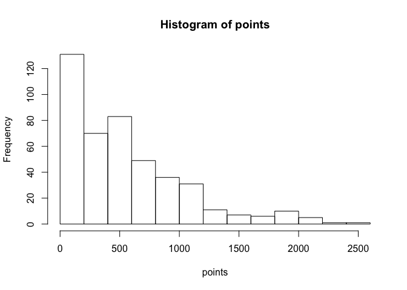
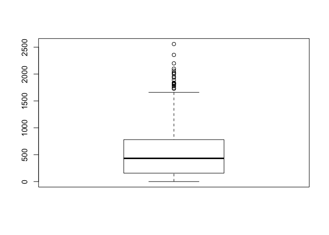
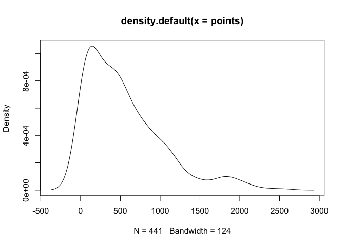
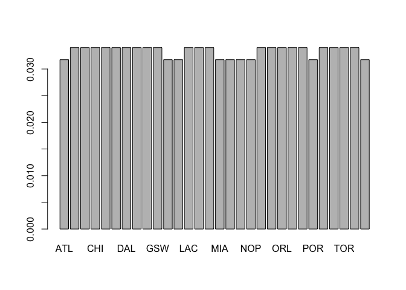

hw-warmup2
================
Sierra Park
9/12/2017

``` r
# load the objects
load("nba2017-salary-points.RData")

# list the available objects
ls()
```

    ## [1] "player"   "points"   "points1"  "points2"  "points3"  "position"
    ## [7] "salary"   "team"

Quantative Variable
===================

I selected "points."

``` r
summary(points)
```

    ##    Min. 1st Qu.  Median    Mean 3rd Qu.    Max. 
    ##     0.0   156.0   432.0   546.6   780.0  2558.0

``` r
mena <- mean(points)
mena
```

    ## [1] 546.6054

``` r
sd(points)
```

    ## [1] 489.0156

``` r
min(points)
```

    ## [1] 0

``` r
max(points)
```

    ## [1] 2558

``` r
median(points)
```

    ## [1] 432

``` r
quantile(points)
```

    ##   0%  25%  50%  75% 100% 
    ##    0  156  432  780 2558

``` r
modes <- unique(points)
modes[which.max(tabulate(match(points, modes)))]
```

    ## [1] 14

``` r
modes <- unique(points)
modes[which.max(tabulate(match(points, modes)))]
```

    ## [1] 14

The typical values in each vector is the mode. The spread is from 0 to 2558. This graph is skewed right, and has a long right tail. There are many outliers that are greater than the maximum, which is 2558. The mean is at 546.6, which is greater than the mode and the median.

This visualization is expected since most average players score within in an average range, while there are only a few exceptionally high-scoring players.

``` r
hist(points)
```



``` r
boxplot(points)
```



``` r
plot(density(points))
```



Qualitative variable I chose is "team"

``` r
newteam <- factor(team)
t <- table(newteam)
total <- sum(t)
#t[nrow(t)+1] <-  c(t/total)
#length(c(t/total))
barplot(t/total)
```



The qualitative variable "team", has similar relative frequencies, only a few teams having relative freuqency less than 0.03. Hence, the shape is almost uniform.

Report my process
=================

1.  It is hard to work with graphs and tables, since we have not covered them in class.
2.  The sd/mean/median functions were not covered in class, but it was doable by searching.
3.  I still do not understand tables.
4.  The most time consuming part was creating tables and working with relative frequencies.
5.  I worked on this by myself.
6.  No frustrating issue.
